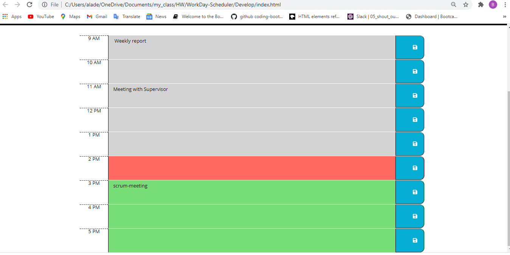

# WorkDay-Scheduler

## Title:
WorkDay scheduler

Link for the deployed site: https://decoste.github.io/WorkDay-Scheduler/

## Description
This is a simple calendar application that allows a user to save events for each hour of the day by modifying starter code. This app will run in the browser and feature dynamically updated HTML and CSS powered by jQuery

The following GIF demonstrates the application functionality:

## Installation

## Table of Contents
  * [Installation](#installation)
  * [Usage](#usage)
  * [Questions](#questions)
  * [License](#license)

## Usage
  * For an employee with a busy schedule to add important events to a daily planner so the employee can manage their time effectively

## License
MIT license

## Questions
The following is my Github account:
[decoste](https://github.com/decoste)

Please feel free to send me an email if you have any question(s) aladecoste@gmail.com

Screenshot of the website:

